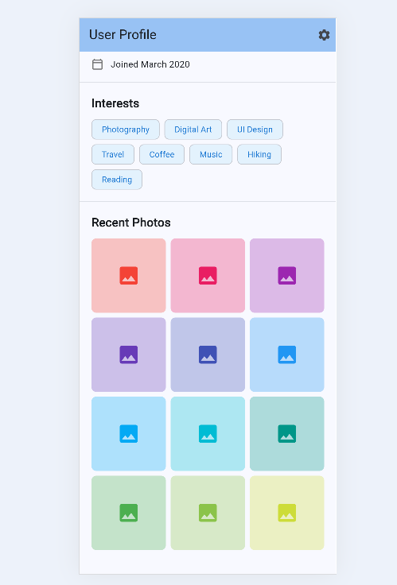

# SingleChildScrollView Demo App

A Flutter demo application showcasing the **SingleChildScrollView** widget through a real-world user profile page example. To be presented on 4 February 2026 

##  About

This app demonstrates how to use SingleChildScrollView to create scrollable content in Flutter. The demo features a complete user profile page with multiple sections including:

- Profile header with avatar and bio
- Statistics (posts, followers, following)
- About information (job, location, website)
- Interests section with chips
- Photo gallery grid

##  Features

- Smooth vertical scrolling
- Multiple content sections
- Responsive design
- Material 3 design system
- Clean and modern UI

##  How to Run

### Prerequisites
- Flutter SDK installed ([Download here](https://flutter.dev/docs/get-started/install))
- Chrome browser (for web) or Android/iOS emulator

### Installation Steps

1. **Clone the repository**
   ```bash
   git clone https://github.com/Samkwizera/singlescrollview_mobile-application.git
   cd singlescrollview_mobile-application
   ```

2. **Install dependencies**
   ```bash
   flutter pub get
   ```

3. **Run the app**
   
   For Web (Chrome):
   ```bash
   flutter run -d chrome
   ```
   
   For Android:
   ```bash
   flutter run -d android
   ```
   
   For iOS:
   ```bash
   flutter run -d ios
   ```

##  Screenshots

<div style="display: flex; gap: 20px;">
  
  
</div>

##  Key SingleChildScrollView Properties

### 1. **child** (Widget)
The single widget that will be scrollable. This is the main content container - typically a `Column` or `Container` that holds all your scrollable content.

```dart
SingleChildScrollView(
  child: Column(
    children: [/* your widgets here */],
  ),
)
```

### 2. **padding** (EdgeInsetsGeometry?)
Adds padding around the scrollable content. Use `EdgeInsets.zero` for no padding, or customize with values like `EdgeInsets.all(16)`.

```dart
SingleChildScrollView(
  padding: EdgeInsets.all(20),  // Adds 20px padding on all sides
  child: Column(...),
)
```

### 3. **physics** (ScrollPhysics?)
Controls the scroll behavior. Common options:
- `BouncingScrollPhysics()` - iOS-style bounce effect
- `ClampingScrollPhysics()` - Android-style edge glow
- `AlwaysScrollableScrollPhysics()` - Always allows scrolling even if content fits
- `NeverScrollableScrollPhysics()` - Disables scrolling

```dart
SingleChildScrollView(
  physics: BouncingScrollPhysics(),  // iOS-style bouncing
  child: Column(...),
)
```


##  Links

- **GitHub Repository**: [github.com/Samkwizera/singlescrollview_mobile-application](https://github.com/Samkwizera/singlescrollview_mobile-application)
- **Flutter Documentation**: [SingleChildScrollView](https://api.flutter.dev/flutter/widgets/SingleChildScrollView-class.html)

##  Author

**Samuel Kwizera Ihimbazwe**

### Resources
- [SingleChildScrollView Widget in Flutter by ahrilog](https://www.youtube.com/watch?v=3IVg5vU7i94)


